# CARBONYX — Verified Blue Carbon Infrastructure


**CARBONYX** turns mangrove restoration into verifiable, tradable carbon credits. It combines satellite-derived biomass estimation, an InVEST-based carbon model, machine-learning classification, and a blockchain settlement layer into one complete **MRV pipeline** — Measure, Report, Verify — from remote sensing to credit retirement.

Register a coastline, let the engine quantify its carbon, get it independently verified, mint **CBX** credits (1 CBX = 1 tCO₂e), trade them on the marketplace, and retire them permanently — with every decision recorded on-chain.

---

## Screenshots

| Home | Verification — role-locked | Marketplace |
|---|---|---|
| 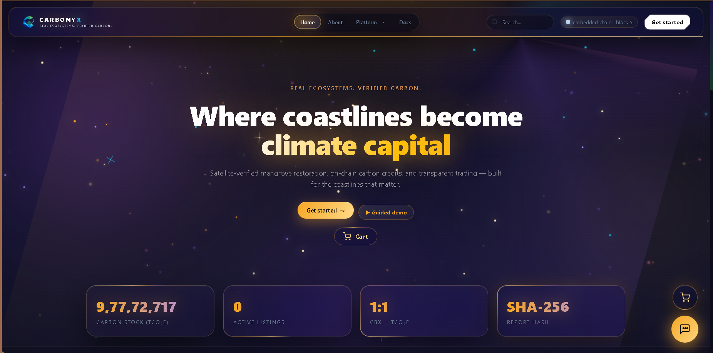 | 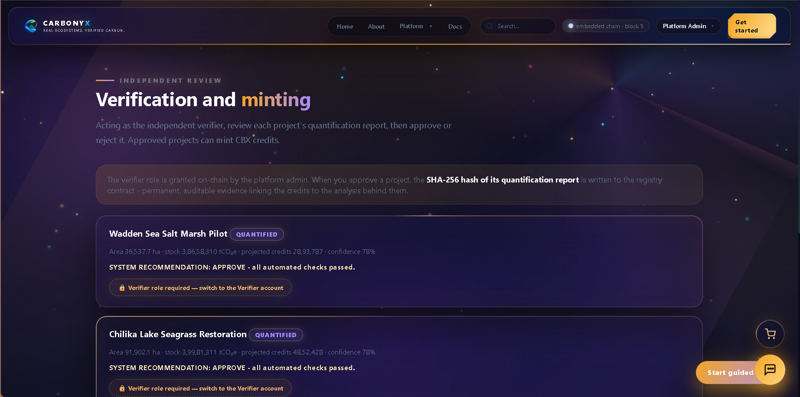 | 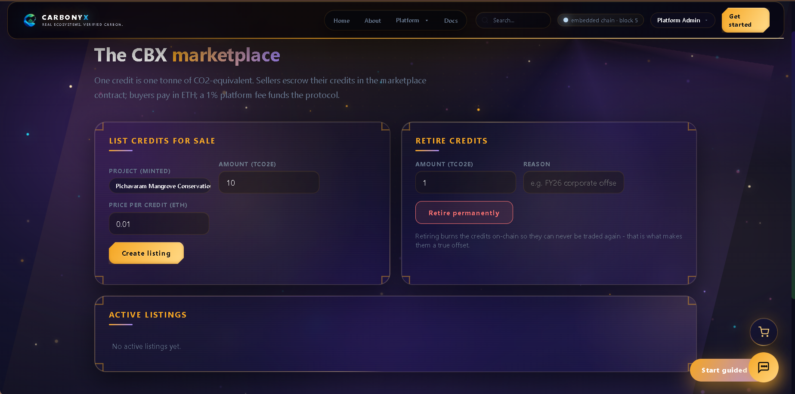 |

| MRV report — satellite before/after | Chain explorer | Dashboard |
|---|---|---|
| 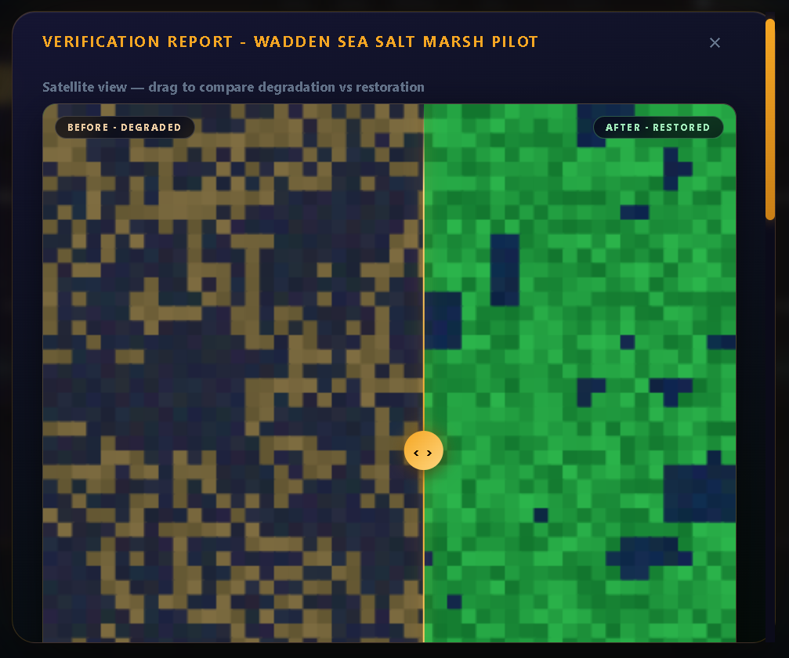 | 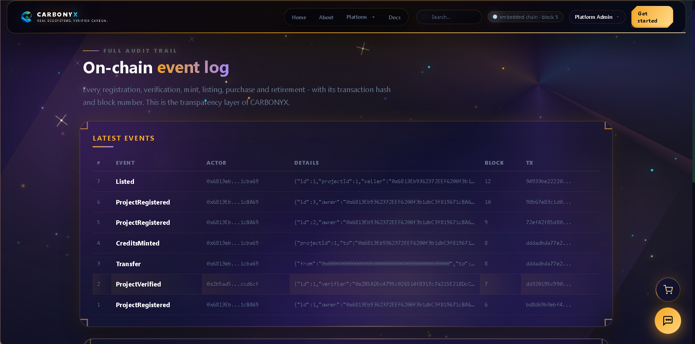 | 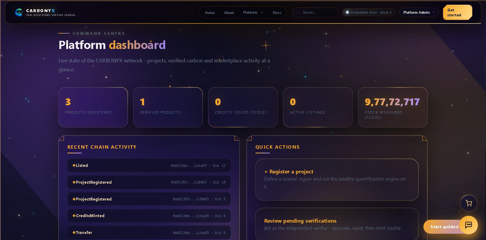 |

| Projects & MRV | Analytics | Interactive map |
|---|---|---|
| 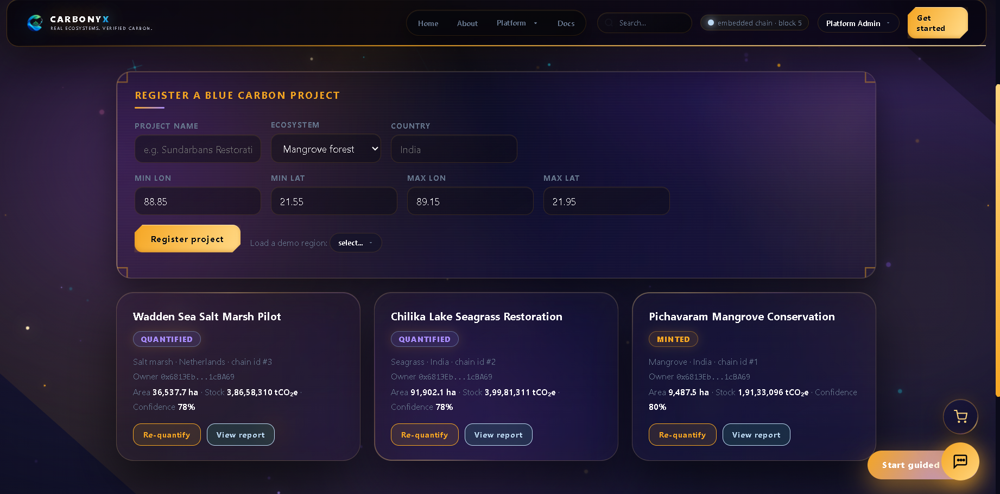 | 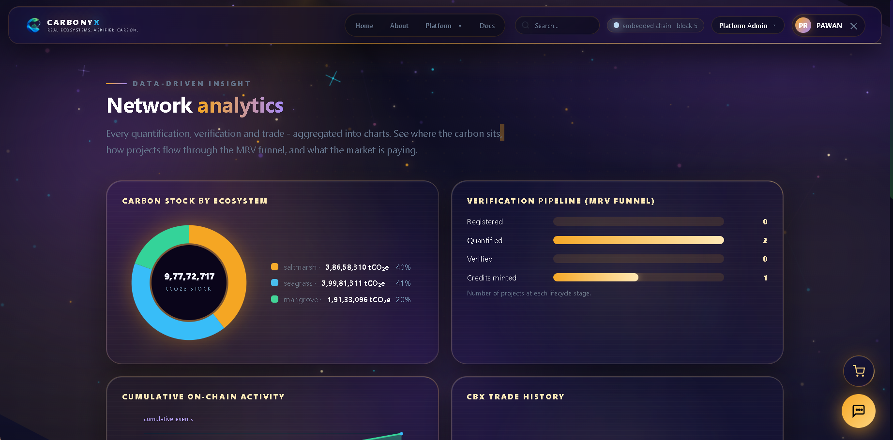 | 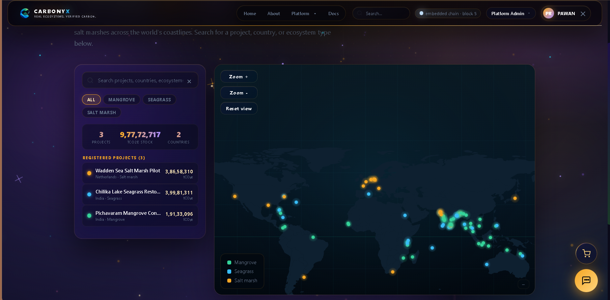 |

| Portfolio | Sign in | Docs |
|---|---|---|
| 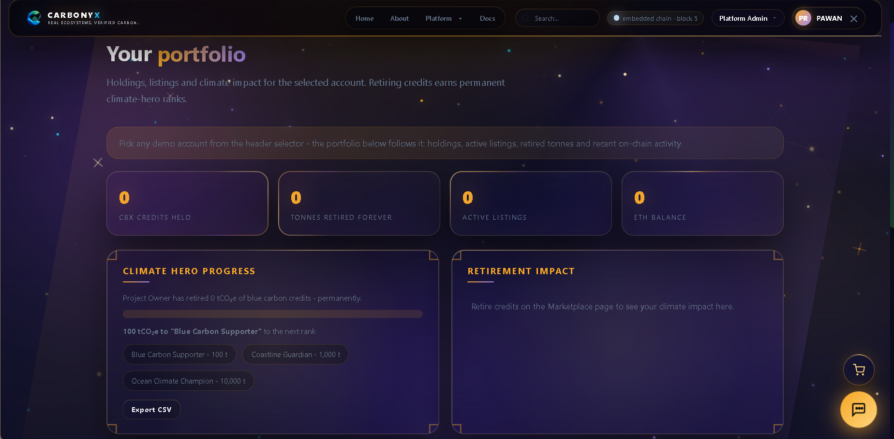 | 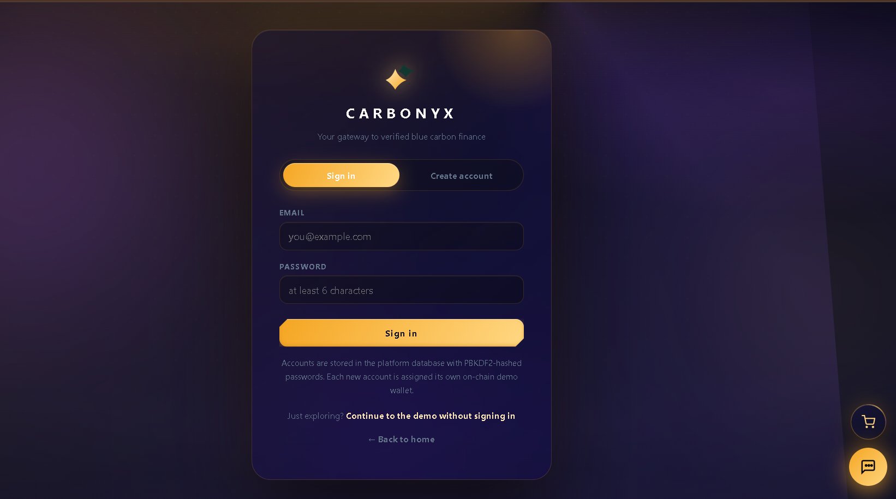 | 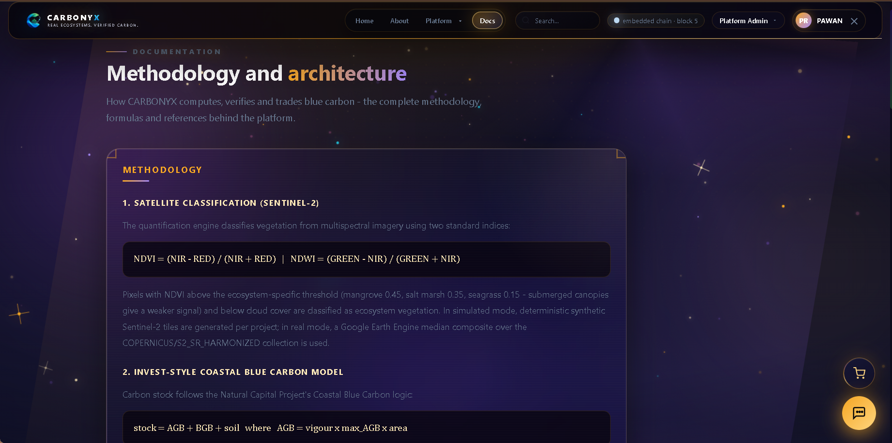 |

---

## Highlights

- **Complete MRV pipeline** — Sentinel-2 band simulation → NDVI/NDWI classification → InVEST carbon model → SHA-256 hashed reports anchored on-chain
- **Role-based access control** — only the independent Verifier account can approve reports and only the Project Owner can mint. Enforced at three layers: UI locks, API 403s, and Solidity modifiers
- **Password-protected privileged roles** — Admin and Verifier require a role password (`carbonyx-verify` / `carbonyx-admin`, overridable via environment variables)
- **Separation of duties** — the platform admin, even with a valid password, cannot verify a project. Trust comes from the contract, not from trusting the operator
- **Embedded blockchain** — a real in-process EVM chain (py-evm + eth-tester) running three Solidity contracts: project registry, CBX credit token, and marketplace escrow
- **Before/after satellite slider** — drag to compare degraded vs restored coastline inside every MRV report
- **Marketplace with settlement** — multi-seller cart, escrow-style checkout, 1% platform fee, permanent retirement
- **12 fully-built pages** — landing, auth, dashboard, analytics, interactive map, portfolio, projects & MRV, verification, marketplace, chain explorer, docs
- **Carbonyx Assistant** — in-app chatbot for guidance and quick queries
- **Galaxy-glass design system** — dark cosmic UI with a rotating starfield, aurora background, frosted glass cards, gold HUD accents, and a travelling border-beam animation on every card
- **Works offline** — if the backend is not running, the frontend falls back to localStorage auth and a demo marketplace, so the UI is always presentable

---

## Tech Stack

| Layer | Technology |
|---|---|
| Backend | Python 3.11 — FastAPI (async REST API), SQLite, PBKDF2 auth |
| Frontend | Vanilla HTML / CSS / JavaScript — no build step, no Node.js |
| Blockchain | Embedded Python EVM chain (py-evm + eth-tester, pycryptodome keccak) |
| Smart contracts | 3 Solidity contracts (registry, CBX credit token, marketplace) |
| Machine learning | scikit-learn — mangrove health / degradation classification |
| Carbon modelling | InVEST coastal blue carbon storage & sequestration model |
| Earth observation | Sentinel-2 simulation — band math, NDVI/NDWI indices, synthetic scenes |

---

## Architecture

```
┌──────────────────────────────────────────────────────────────┐
│  FRONTEND — 12 pages, vanilla HTML/CSS/JS                    │
│  glass UI · starfield canvas · cart · Carbonyx Assistant     │
│  (auto-detects backend; localStorage fallback when offline)  │
└───────────────────────────┬──────────────────────────────────┘
                            │ REST (fetch)
┌───────────────────────────▼──────────────────────────────────┐
│  BACKEND — FastAPI                                           │
│  ├── auth (PBKDF2, sessions, role passwords)                 │
│  ├── projects & MRV reports (SQLite)                         │
│  ├── Sentinel-2 simulation + ML classifier                   │
│  ├── InVEST carbon model (stock / sequestration / buffer)    │
│  └── marketplace & settlement                                │
└───────────────────────────┬──────────────────────────────────┘
                            │ in-process calls
┌───────────────────────────▼──────────────────────────────────┐
│  EMBEDDED EVM CHAIN (py-evm)                                 │
│  ProjectRegistry.sol · CarbonyxCredit.sol · Marketplace.sol  │
│  every mint / trade / retirement = transaction in a block    │
└──────────────────────────────────────────────────────────────┘
```

---

## Quick Start

Requires **Python 3.11+**. Nothing else — no Node.js, no Hardhat, no external chain.

```bash
cd carbonyx
python start.py
```

That's it. The launcher installs dependencies on first run, boots the API + embedded chain on `http://localhost:8000`, seeds three demo projects, and opens your browser. Keep the terminal window open while using the site.

To run manually:

```bash
pip install -r backend/requirements.txt
cd backend && python run.py
```

---

## Roles & Access Model

The platform models four independent actors. Each is a separate on-chain account, selectable from the navbar; the acting account signs every transaction.

| Role | Can do | Password |
|---|---|---|
| **Platform Admin** | Deploy contracts, hold platform fees | `carbonyx-admin` |
| **Verifier** | Approve or reject MRV reports | `carbonyx-verify` |
| **Project Owner** | Register projects, mint credits | — |
| **Buyer / Offsetter** | Purchase and retire credits | — |

The rules are enforced at three layers:

1. **UI** — buttons are replaced by a locked chip when the acting role lacks permission
2. **API** — `/verify` and `/mint` return `403` for the wrong role or a missing role token
3. **Smart contract** — `onlyVerifier` and `msg.sender == project.owner` modifiers reject the transaction on-chain

Privileged roles unlock with a password (`POST /api/auth/unlock`), which issues a one-hour role token carried in the `X-Role-Token` header. Override the defaults with `CARBONYX_ADMIN_PASSWORD` and `CARBONYX_VERIFIER_PASSWORD`.

---

## The Demo Walkthrough (golden path)

1. **Sign up** (or pick a demo account) — accounts are PBKDF2-hashed and tied to chain addresses
2. **Register a project** — `Projects & MRV` → load a demo region or draw a bounding box on the coast
3. **Quantify** — run the satellite simulation + ML classification + InVEST carbon model; inspect the MRV report (its SHA-256 hash becomes its identity)
4. **Try to verify as the wrong role** — switch to Buyer and open `Verification`: the buttons are locked. The UI, the API, and the contract all refuse
5. **Verify** — switch to **Verifier** (password: `carbonyx-verify`), approve the report; the hash is anchored on-chain
6. **Mint** — as the **Project Owner**, mint CBX credits, gated by a conservative buffer
7. **Trade** — list credits on the marketplace, add to cart, checkout with escrow settlement
8. **Retire** — retire credits permanently and print the retirement certificate
9. **Audit** — open the Chain Log to see every block and transaction of the journey

---

## API Surface (selected)

| Method | Endpoint | Notes |
|---|---|---|
| `POST` | `/api/auth/signup` · `/login` | PBKDF2-hashed accounts, session tokens |
| `POST` | `/api/auth/unlock` | Role password → one-hour role token |
| `GET` | `/api/accounts` | Demo chain accounts with roles and balances |
| `POST` | `/api/projects` | Register a project (on-chain) |
| `POST` | `/api/projects/{id}/quantify` | Run the MRV engine, hash the report |
| `POST` | `/api/projects/{id}/verify` | Verifier role + role token required |
| `POST` | `/api/projects/{id}/mint` | Project owner only |
| `GET` | `/api/marketplace` | Active listings |
| `POST` | `/api/marketplace/checkout` | Escrow settlement + platform fee |
| `POST` | `/api/credits/retire` | Permanent retirement |
| `GET` | `/api/events` | On-chain activity feed |

Full interactive docs at `http://localhost:8000/docs` (FastAPI auto-generated).

---

## Project Structure

```
carbonyx/
├── start.py                    # one-command launcher
├── backend/
│   ├── app/
│   │   ├── main.py             # FastAPI app, routes, static hosting
│   │   ├── routers/            # auth, projects, verification, marketplace, chain
│   │   ├── gee/                # Sentinel-2 simulation
│   │   ├── invest/             # carbon model
│   │   ├── ml/                 # mangrove health classifier
│   │   └── blockchain.py       # embedded EVM, contract deployment
│   └── requirements.txt
├── contracts/
│   ├── contracts/              # ProjectRegistry.sol · CarbonyxCredit.sol · Marketplace.sol
│   └── artifacts/              # compiled ABI + bytecode
└── frontend/
    ├── *.html                  # 12 pages
    ├── css/                    # base + per-page + cinema/ocean design layers
    ├── js/                     # core.js (navbar, API, roles, starfield), per-page logic
    └── data/                   # region datasets
```

---

## Known Limitations (honest list)

- Sentinel-2 scenes are **simulated** — synthetic band data, not live Copernicus imagery
- The chain is an **embedded demo network** with development keys — not a public chain
- Verification is a **single-verifier flow** — no accredited third party or multi-party quorum yet
- Marketplace is peer-to-peer within the demo; no external liquidity or fiat rails
- Demo data resets when `backend/data/` is removed

---

## Roadmap

- **Real Earth observation** — swap the simulator for live Copernicus Data Space (Sentinel-2) imagery
- **Public chain anchoring** — anchor report hashes to an established network (e.g. Polygon) instead of the embedded chain
- **Methodology alignment** — align quantification with Verra VM0033 / IPCC Wetlands Supplement for credit eligibility
- **Field validation** — ground-truth plots with an NGO pilot project
- **Retirement certificates as signed PDFs** with QR-verifiable on-chain proof

---

## About the Builder

Built solo by **Pawan Rathod** — full-stack engineer and founder-in-progress. CARBONYX started as a question: *what would it take to make a carbon credit you can actually trust?* The answer turned out to be a real MRV pipeline, a real EVM chain, and a governance model where nobody — not even the platform owner — can verify their own project.

If you are working on blue carbon, MRV, or on-chain environmental assets, I'd love to talk.
